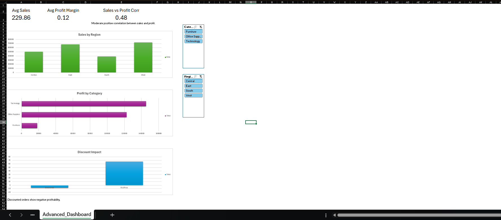

# 📈 Advanced Business Analytics Dashboard (Excel)

## Overview  
Built an advanced Excel analytics dashboard using sales data to analyze regional performance, category profitability, discount impact, and statistical relationships.

---

## Skills Demonstrated  
- Advanced formulas (IFS, XLOOKUP, RANK, CORREL)  
- Statistical analysis (mean, median, std dev)  
- Pivot Tables & KPIs  
- Interactive dashboards with slicers  

---

## Key Insights  
- West region generates highest sales  
- Technology category is most profitable  
- Discounted orders show negative average profit  
- Moderate positive correlation (0.48) between sales and profit  

---

## Dashboard  

